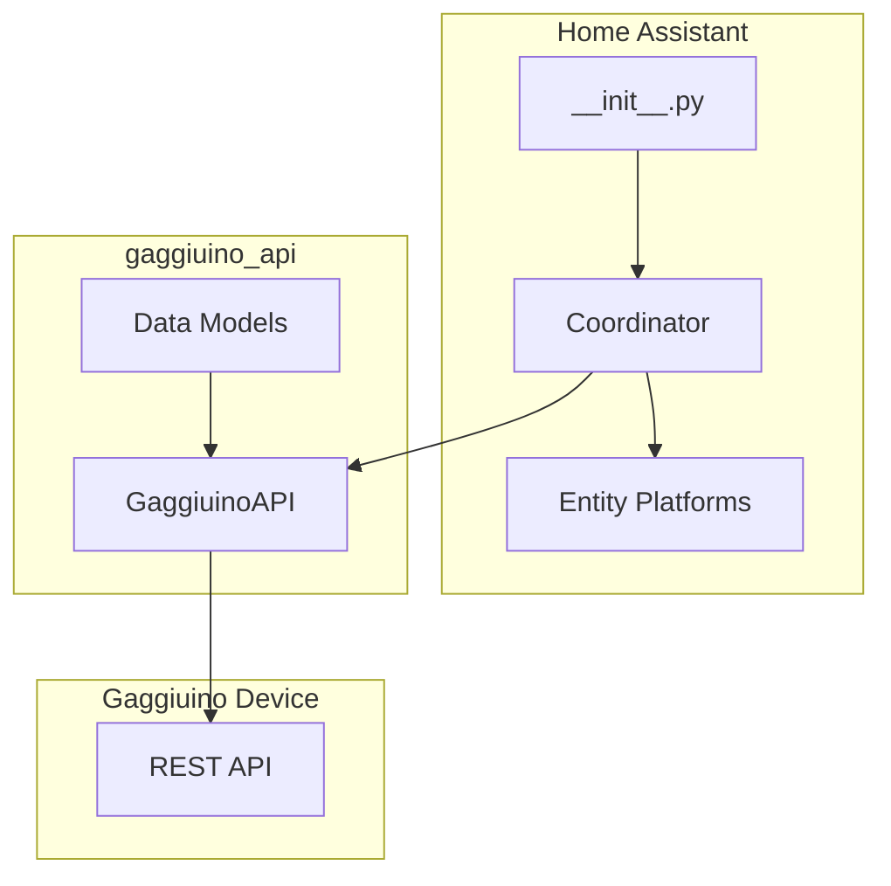

# Gaggiuino Home Assistant Integration - Agent Guidelines

## Project Overview

This is a Home Assistant custom integration for the Gaggiuino espresso machine controller. It provides sensors, binary sensors, selects, numbers, switches, and lights to monitor and control a Gaggiuino device through its API.

## Project Structure

```
hass-gaggiuino/
├── custom_components/
│   └── gaggiuino/
│       ├── __init__.py          # Integration setup and platform registration
│       ├── binary_sensor.py     # Binary sensor entities (availability, health, switches)
│       ├── config_flow.py       # UI configuration flow
│       ├── const.py             # Constants (DOMAIN, CONF_PROFILE)
│       ├── coordinator.py       # Data update coordinator - fetches and caches all API data
│       ├── light.py             # LED light entity with RGB support
│       ├── manifest.json        # Integration metadata and dependencies
│       ├── number.py            # Number entities (steam set point)
│       ├── select.py            # Select entities (profile, release channel)
│       ├── sensor.py            # Sensor entities (temperature, pressure, versions, etc.)
│       ├── switch.py            # Switch entities (LED disco, scales toggles)
│       └── translations/
│           └── en.json          # English translations for all entities
├── blueprints/                   # Automation blueprints
├── config/                       # Development configuration
└── scripts/                      # Development scripts (develop, lint, setup)
```

## Key Dependencies

- **gaggiuino_api**: External Python package that provides the API client
- **Home Assistant Core**: Provides the base integration framework

## Architecture

### Data Flow



### Coordinator Pattern

The [`coordinator.py`](custom_components/gaggiuino/coordinator.py) is the central data hub:

1. **Data Fetching**: `_async_update_data()` fetches all data every 30 seconds
2. **Caching**: Stores status, profiles, settings, versions, firmware progress
3. **Update Methods**: Provides methods to update settings back to the API

### Entity Pattern

All entities follow the same pattern:

```python
class GaggiuinoEntity(CoordinatorEntity, PlatformEntity):
    def __init__(self, coordinator: GaggiuinoDataUpdateCoordinator) -> None:
        super().__init__(coordinator)
        self._attr_unique_id = f"{coordinator.entry.entry_id}_{key}"
        self._attr_device_info = coordinator.device_info
```

## Coding Standards

### Python Style

- Use Python 3.10+ syntax (type hints with `|` union syntax)
- Use `from __future__ import annotations` for forward references
- Follow Home Assistant's entity patterns
- Use dataclasses for entity descriptions

### Entity Categories

- **EntityCategory.CONFIG**: User-configurable settings (steam set point, release channel, switches)
- **EntityCategory.DIAGNOSTIC**: Read-only diagnostic data (versions, uptime, firmware status)

### Entity Registry Default

- Diagnostic entities: `entity_registry_enabled_default = False`
- Config entities: Enabled by default (no explicit setting needed)

### Frozen Dataclasses

The API models are frozen dataclasses. **Never try to modify their attributes directly.** Instead:
- Create a new instance with updated values
- Use `to_api_dict()` method to get a mutable dictionary for updates

### Async Patterns

- All API calls must be awaited
- Use `async with self.api:` context manager for API operations
- Never call async methods from properties (use cached values instead)

## Common Tasks

### Adding a New Sensor

1. Add sensor description to `SENSORS` tuple in [`sensor.py`](custom_components/gaggiuino/sensor.py)
2. Add translation key to [`translations/en.json`](custom_components/gaggiuino/translations/en.json)
3. If data comes from a new API endpoint, update [`coordinator.py`](custom_components/gaggiuino/coordinator.py)

### Adding a New Control Entity

1. Create entity class following the pattern in existing platform files
2. Add to `async_setup_entry()` function
3. Add translation key to translations
4. Add update method to coordinator if needed

### Updating Settings

```python
# Get current settings as dict
new_settings = coordinator.led_settings.to_api_dict()
# Modify the dict
new_settings["disco"] = True
# Send update
await coordinator.update_led_settings(new_settings)
await coordinator.async_request_refresh()
```

## Testing

- Use the `scripts/develop` script for local development
- Use `scripts/lint` to check code quality
- Test with actual Gaggiuino hardware or mock API

## Related Projects

- **gaggiuino_api**: The underlying API library
- **Gaggiuino Firmware**: The device firmware that provides the REST API

## Important Notes

1. **Profile Selection**: The `select_profile` method cannot modify the frozen `GaggiuinoStatus` dataclass. The profile change is reflected after the next coordinator refresh.

2. **Health Check**: The `health_ok()` method is async, so the `_healthy` cached property is used for binary sensor state.

3. **Settings Updates**: Always call `async_request_refresh()` after updating settings to ensure the coordinator fetches fresh data.

4. **Platform Registration**: New platforms must be added to `PLATFORMS` list in [`__init__.py`](custom_components/gaggiuino/__init__.py).
